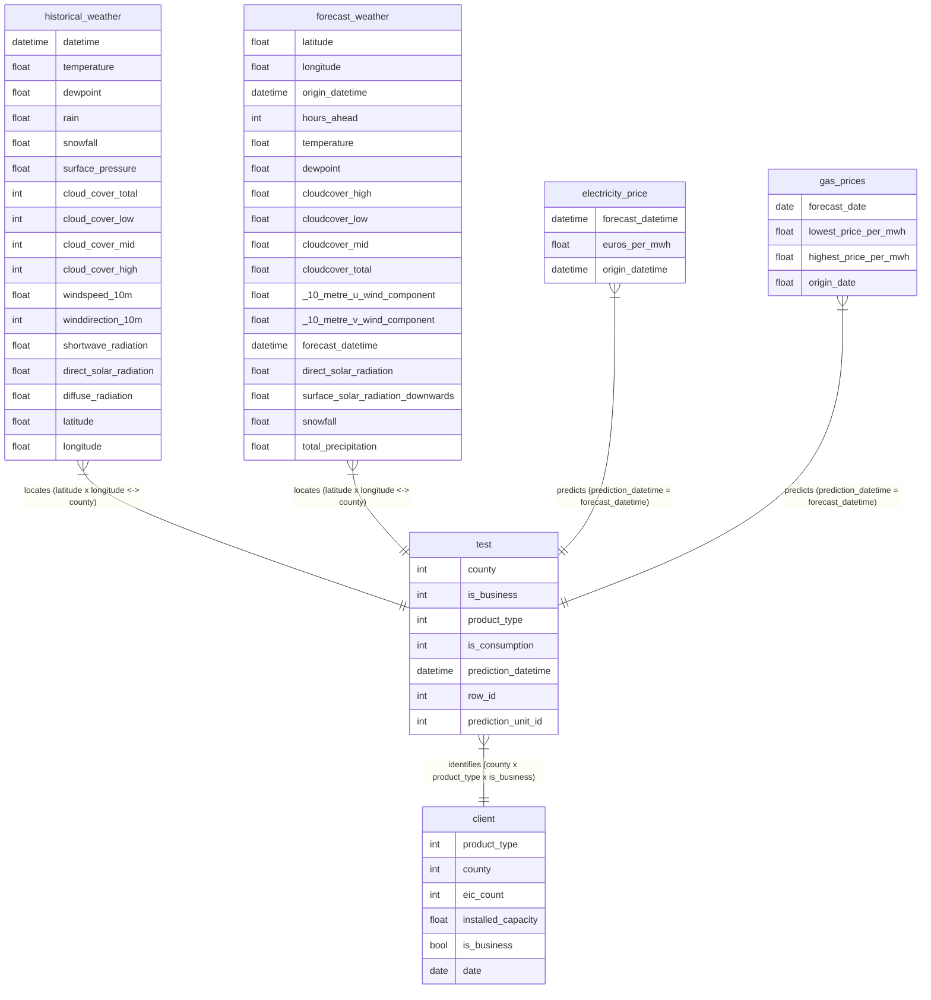

# Enefit - Predict Energy Behavior of Prosumers

Personnal analysis and solution for a [Kaggle Challenge](https://www.kaggle.com/competitions/predict-energy-behavior-of-prosumers/overview) proposed by Enefit to predict energy production and consumption of prosumers.

## [TODO] Repository Structure

## Data sctructure and relationship

Notes:
- Compared to test, train has a `target` which is the value to predict either for consumption or production
- The column `prediction_datetime` in test dataframe corresponds to the `datetime` column in train
- Historical weather and forecast weather dataframes share similar columns: `latitude`, `longitude`, `dewpoint`, `snowfall`, `cloudcover_xxx` and `direct_solar_radiation`
- Historical weather and forecast weather dataframes share wind data with different conventions (polar coordinates vs cartesian coordinates): (`windspeed_10m`, `winddirection_10m`) = (`_10_metre_u_wind_component`, `_10_metre_v_wind_component`)
- Historical weather and foraecast weather dataframes share solar radiation data with different conventions but since description is not clear enough, we assume that: `surface_solar_radioation_downwards` = `shortwave_radiation` + `diffuse_radiation`

## TODO

### Simplest baseline

#### EDA
- [ ] Univariate analysis
- [ ] Multivariate analysis
- [ ] Check for missing values
- [ ] Correlation matrix
- [ ] PCA

#### Feature engineering
- [ ] Average weather data to the related county using `weather_station_to_county_mapping.csv`
- [ ] Remove `origin_datetime` in electricity_price, gas_prices and forecast_weather
- [ ] Remove `dewpoint`, `rain`, `surface_pressure`, `cloudcover_high`, `cloudcover_low`, `cloudcover_mid`, `total_precipitation` in historical_weather and forecast_weather
- [ ] List and remove useless columns for a first version and list columns that could help improve in further versions
- [ ] Do not use historical weather data
- [ ] Split train data into train and validation sets
- [ ] Normalize data

#### Model selection
- [ ] Baseline model?
- [ ] Learn time-series forecasting techniques (ARIMA, SARIMA...)
- [ ] Implement a simple model

#### Evaluation
- [ ] Test best model on test set using MAE

### Further versions

#### EDA
- [ ] Check historical vs forecast weather data

#### Feature engineering
- [ ] Use local forecast weather data instead of average one
- [ ] Include historical weather data
- [ ] Reencode `product_type` to a more relevant way like onehot (cf Kaggle description `{0: "Combined", 1: "Fixed", 2: "General service", 3: "Spot"}`)

#### Model selection
- [ ] Litterature review on time-series forecasting
- [ ] Test Prophet
- [ ] Test XGBoost
- [ ] Train & evaluate LSTM, GRU, RNN
- [ ] Train & evaluate Transformers?
